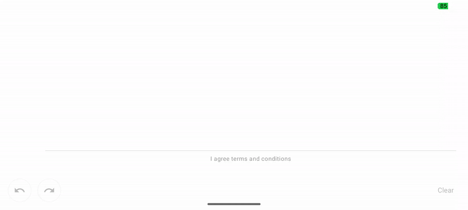

# La Matemática Detrás de las Firmas Digitales Suaves

*O por qué tus trazos se ven como un Etch A Sketch y cómo solucionarlo con curvas de Bézier*



Hace unos meses estaba implementando captura de firmas en una app de contratos digitales. El primer intento fue obvio: captura eventos touch, conecta los puntos con líneas rectas, listo. El resultado se parecía más a un dibujo de preescolar que a una firma profesional. **El problema no era el código, era la matemática.**

---

## El Problema con las Líneas Rectas

Cuando capturas eventos touch en Android, obtienes puntos discretos:

```
Touch events: •     •    •      •   •
                ↓
Connected:    •-----•----•------•---•
```

El ojo humano detecta inmediatamente el problema: **las esquinas afiladas**. Una firma real es un movimiento continuo y fluido, no una secuencia de segmentos rectos.

Pero hay un segundo problema más sutil: **el grosor constante**. Una firma real varía su grosor según la velocidad de tu mano. Escribe "a" lentamente y luego rápido: el trazo rápido es más delgado. Esta variación es lo que hace que una firma se sienta "natural".

---

## La Solución: Interpolación con Curvas de Bézier

La clave está en **interpolar** entre los puntos capturados usando curvas de Bézier cúbicas. En lugar de líneas rectas, creamos curvas suaves.

### ¿Qué es una Curva de Bézier?

Una curva de Bézier cúbica se define con 4 puntos:
- **P₀**: Punto inicial
- **P₁, P₂**: Puntos de control (no están en la curva, la "guían")
- **P₃**: Punto final

La fórmula paramétrica es:

```
B(t) = (1-t)³·P₀ + 3(1-t)²t·P₁ + 3(1-t)t²·P₂ + t³·P₃
```

Donde `t` va de 0 a 1. Cuando `t=0` estamos en P₀, cuando `t=1` estamos en P₃, y entre medio la curva fluye suavemente.

### Calculando los Puntos de Control

El truco está en **cómo calculamos P₁ y P₂**. No podemos elegirlos arbitrariamente o la curva podría hacer loops extraños. Necesitamos que la transición entre curvas sea suave.

Aquí está el algoritmo (basado en Catmull-Rom):

```kotlin
fun calculateControlPoints(
    s1: Point,  // Punto anterior
    s2: Point,  // Punto actual
    s3: Point   // Punto siguiente
): Pair<Point, Point> {
    // Vectores entre puntos
    val dx1 = s1.x - s2.x
    val dy1 = s1.y - s2.y
    val dx2 = s2.x - s3.x
    val dy2 = s2.y - s3.y
    
    // Puntos medios
    val m1 = Point((s1.x + s2.x) / 2f, (s1.y + s2.y) / 2f)
    val m2 = Point((s2.x + s3.x) / 2f, (s2.y + s3.y) / 2f)
    
    // Distancias (para ponderar)
    val l1 = sqrt(dx1 * dx1 + dy1 * dy1)
    val l2 = sqrt(dx2 * dx2 + dy2 * dy2)
    
    // Razón de distancias
    val k = l2 / (l1 + l2)
    
    // Centro móvil ponderado
    val cm = Point(
        m2.x + (m1.x - m2.x) * k,
        m2.y + (m1.y - m2.y) * k
    )
    
    // Desplazamiento para tangente suave
    val tx = s2.x - cm.x
    val ty = s2.y - cm.y
    
    // Puntos de control finales
    return Pair(
        Point(m1.x + tx, m1.y + ty),  // P₁
        Point(m2.x + tx, m2.y + ty)   // P₂
    )
}
```

**¿Qué hace este código?**

1. **Calcula puntos medios** entre segmentos consecutivos
2. **Pondera por distancia** (k factor) para que curvas cortas y largas se mezclen bien
3. **Desplaza los puntos de control** para que la curva pase suavemente por s2

El resultado: **transiciones C1-continuas** (la primera derivada es continua = sin esquinas).

---

## Agregando Grosor Variable: La Física del Trazo

Ahora que tenemos curvas suaves, queremos que el grosor varíe con la velocidad. Esto requiere dos cosas:

### 1. Capturar Timestamps

```kotlin
data class TimedPoint(
    val x: Float,
    val y: Float,
    val timestamp: Long = System.currentTimeMillis()
)
```

Con timestamps podemos calcular velocidad:

```kotlin
fun velocityFrom(start: TimedPoint): Float {
    val deltaTime = (timestamp - start.timestamp).toFloat()
    if (deltaTime == 0f) return 0f
    
    val distance = sqrt(
        (x - start.x).pow(2) + 
        (y - start.y).pow(2)
    )
    
    return distance / deltaTime  // px/ms
}
```

### 2. Mapear Velocidad → Grosor

La relación no es lineal. Queremos que:
- **Movimientos lentos** → Trazo grueso
- **Movimientos rápidos** → Trazo delgado
- **Transiciones suaves** (no saltos bruscos)

Fórmula:

```kotlin
fun strokeWidth(velocity: Float, minWidth: Float, maxWidth: Float): Float {
    return max(maxWidth / (velocity + 1f), minWidth)
}
```

La división hace que el grosor decrezca con velocidad, y el `+1` evita división por cero.

**Pero hay un problema**: La velocidad entre dos puntos puede tener ruido (jitter del sensor touch). Si aplicamos el grosor directamente, obtenemos variaciones bruscas.

**Solución**: **Filtro de suavizado exponencial** (EMA - Exponential Moving Average):

```kotlin
var smoothedVelocity = 0f
val alpha = 0.9f  // Factor de suavizado (0.0-1.0)

fun updateVelocity(newVelocity: Float) {
    smoothedVelocity = alpha * smoothedVelocity + (1 - alpha) * newVelocity
}
```

Con `alpha = 0.9`, el 90% del grosor viene del frame anterior y 10% del nuevo. Esto crea transiciones graduales y orgánicas.

---

## Renderizando la Curva: De Matemática a Píxeles

Tenemos la curva matemática, pero `Canvas.drawPath()` de Android no soporta grosor variable directamente. Necesitamos **dividir la curva en segmentos pequeños** y dibujar cada uno con su grosor:

```kotlin
fun drawBezierCurve(
    canvas: Canvas,
    curve: Bezier,
    startWidth: Float,
    endWidth: Float,
    paint: Paint
) {
    val steps = ceil(curve.length()).toInt()
    val widthDelta = endWidth - startWidth
    
    repeat(steps) { step ->
        val t = step.toFloat() / steps
        
        // Interpolación cúbica del grosor (t³ para suavidad)
        val width = startWidth + widthDelta * t * t * t
        
        // Punto en la curva (fórmula de Bézier)
        val t1 = 1f - t
        val t1_2 = t1 * t1
        val t1_3 = t1_2 * t1
        val t_2 = t * t
        val t_3 = t_2 * t
        
        val x = t1_3 * curve.p0.x +
                3f * t1_2 * t * curve.p1.x +
                3f * t1 * t_2 * curve.p2.x +
                t_3 * curve.p3.x
                
        val y = t1_3 * curve.p0.y +
                3f * t1_2 * t * curve.p1.y +
                3f * t1 * t_2 * curve.p2.y +
                t_3 * curve.p3.y
        
        paint.strokeWidth = width
        canvas.drawPoint(x, y, paint)
    }
}
```

**Detalles clave**:

1. **Número de steps** basado en la longitud de la curva: Curvas largas necesitan más puntos
2. **Interpolación cúbica del grosor** (`t³`): Hace que el cambio sea gradual
3. **Dibujamos puntos**, no líneas: Con `strokeCap = ROUND` los puntos se superponen suavemente

---

## El Sistema UNDO/REDO: Granularidad Correcta

Un detalle importante: **¿Qué es una unidad de "undo"?**

- ❌ **Cada punto**: Demasiado granular, frustrante
- ❌ **Todo el dibujo**: No útil
- ✅ **Cada trazo completo** (de touch down a touch up): Perfecto

Implementación simple con dos stacks:

```kotlin
class SignatureState {
    private val strokes = mutableListOf<Stroke>()
    private val redoStack = mutableListOf<Stroke>()
    private var currentStroke = mutableListOf<Curve>()
    
    fun onTouchDown(point: Point) {
        currentStroke.clear()
    }
    
    fun onTouchMove(point: Point) {
        // Agregar curva a currentStroke
        currentStroke.add(calculateCurve(point))
    }
    
    fun onTouchUp() {
        if (currentStroke.isNotEmpty()) {
            strokes.add(Stroke(currentStroke.toList()))
            redoStack.clear()  // Nueva acción invalida redo
        }
    }
    
    fun undo() {
        if (strokes.isNotEmpty()) {
            val stroke = strokes.removeLast()
            redoStack.add(stroke)
        }
    }
    
    fun redo() {
        if (redoStack.isNotEmpty()) {
            val stroke = redoStack.removeLast()
            strokes.add(stroke)
        }
    }
}
```

La inmutabilidad de `Stroke` es clave: podemos moverlo entre stacks sin preocuparnos por modificaciones.

---

## Optimización: 60 FPS o Nada

Dibujar curvas Bézier en cada frame puede ser costoso. Tres optimizaciones críticas:

### 1. Object Pooling

```kotlin
// ❌ Crea objetos en hot path
fun onTouchMove(point: Point) {
    val controls = calculateControlPoints(...)  // Nueva instancia
    val curve = Bezier(...)  // Nueva instancia
}

// ✅ Reutiliza objetos
private val controlPointsCache = ControlPoints()
private val curveCache = Bezier()

fun onTouchMove(point: Point) {
    calculateControlPoints(..., cache = controlPointsCache)
    curveCache.set(...)  // Reutiliza instancia existente
}
```

### 2. Canvas Nativo vs Compose Canvas

```kotlin
// Compose Canvas es declarativo, pero queremos imperativo para performance
Canvas(modifier) {
    // ❌ Lento: Recompone todo en cada frame
    strokes.forEach { stroke ->
        drawPath(stroke.path, ...)
    }
}

// ✅ Rápido: Dibuja en bitmap mutable
val bitmap = remember { Bitmap.createBitmap(...) }
val nativeCanvas = remember { Canvas(bitmap) }

// Dibuja nuevas curvas en el bitmap (imperativo)
LaunchedEffect(newCurve) {
    drawBezierCurve(nativeCanvas, newCurve, ...)
}

// Compose solo renderiza el bitmap (cheap)
Canvas(modifier) {
    drawIntoCanvas { it.nativeCanvas.drawBitmap(bitmap, 0f, 0f, null) }
}
```

### 3. derivedStateOf para Cálculos

```kotlin
// ❌ Recalcula en cada recomposición
val penWidthPx = with(LocalDensity.current) { penWidth.toPx() }

// ✅ Solo recalcula cuando penWidth cambia
val penWidthPx by remember {
    derivedStateOf { with(density) { penWidth.toPx() } }
}
```

**Resultado**: 60 FPS consistente incluso en trazos rápidos.

---

## El Resultado: Firmas que Se Sienten Reales

La combinación de estas técnicas produce firmas que:

- ✅ **Fluyen naturalmente** (curvas Bézier)
- ✅ **Varían en grosor** (velocidad + suavizado)
- ✅ **Responden instantáneamente** (optimizaciones)
- ✅ **Permiten errores** (undo/redo granular)


Compara este resultado con líneas rectas simples. La diferencia no es sutil: es la diferencia entre "funcional" y "profesional".

---

## El Código Está Disponible

Implementé todas estas técnicas en una librería open source: [**signature-pad**](https://github.com/rulogarcillan/signature-pad)

```kotlin
// La API es simple...
@Composable
fun MySignature() {
    val state = rememberSignaturePadState()
    SignaturePad(state = state)
}

// ...pero la implementación es matemática pura
```

Si quieres profundizar, el código más interesante está en:
- `Bezier.kt` - Implementación de curvas cúbicas
- `SignaturePad.kt` - Renderizado y optimizaciones
- `BezierDrawing.kt` - Algoritmo de dibujo con grosor variable

---

## Reflexiones Finales

Capturar firmas digitales parece trivial hasta que lo intentas. La diferencia entre "funcional" y "excelente" está en los detalles matemáticos:

- **Interpolación correcta** elimina esquinas
- **Grosor variable** añade naturalidad
- **Suavizado de velocidad** previene jitter
- **Optimizaciones** mantienen fluidez

La próxima vez que firmes en una tablet y el trazo se vea perfecto, recuerda: hay curvas de Bézier y filtros exponenciales trabajando en segundo plano.

---

*Si implementas captura de firmas (o cualquier dibujo táctil), ¿usas interpolación? ¿Qué técnicas te funcionan? 💬*

---

**Rulo Garcillan** | [GitHub](https://github.com/rulogarcillan) | Android & Kotlin

