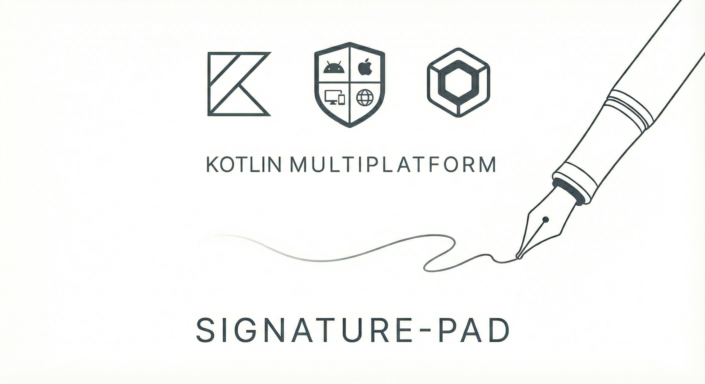
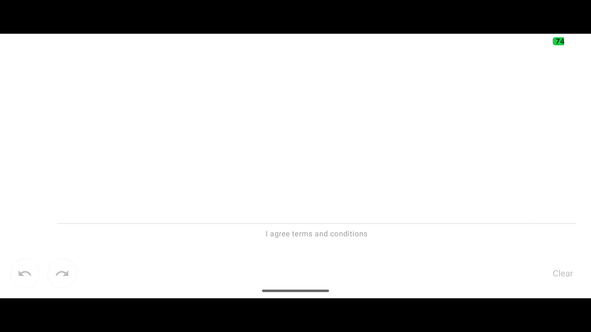

# Signature Pad KMP


  


[](https://central.sonatype.com/artifact/com.tuppersoft/signature-pad)
[](https://opensource.org/licenses/Apache-2.0)
[](https://kotlinlang.org/docs/multiplatform.html)
[](https://kotlinlang.org)
[](https://www.jetbrains.com/lp/compose-multiplatform/)

A modern **Kotlin Multiplatform** library for capturing smooth signature drawings with **UNDO/REDO** functionality, built with **Compose Multiplatform**.

✅ **Fully Supported**: Android • Desktop (JVM) • iOS • Web (Wasm/JS)

Enhanced fork of [gcacace/android-signaturepad](https://github.com/gcacace/android-signaturepad), completely rewritten in Kotlin for KMP with Compose Multiplatform.

  


---

## ✨ Features

### 🎨 Drawing Engine
- **Smooth Bézier Curves**: Catmull-Rom spline interpolation for natural stroke rendering
- **Velocity-Based Width**: Dynamic stroke width based on drawing speed (faster = thinner, slower = thicker)
- **Pressure Simulation**: Gamma curve adjustment for realistic pen pressure feel
- **Adaptive Smoothing**: EMA filters for velocity and width transitions (configurable 0.0-1.0)
- **Noise Filtering**: Configurable input threshold to eliminate hand shake and jitter

### ⚙️ Configuration & Customization
- **3 Pre-configured Presets**: Fountain pen, BIC pen, Edding marker with optimized parameters
- **9 Adjustable Parameters**: Width range, color, velocity thresholds, smoothing weights, pressure gamma, noise threshold
- **Custom Color Support**: Any color for pen strokes
- **Type-safe Configuration**: Immutable data classes with Kotlin DSL

### 🎯 User Experience
- **Full UNDO/REDO**: Complete history management for individual strokes
- **Multiple Export Formats**: Bitmap (white/transparent background), SVG with auto-crop support
- **Smart Crop**: Automatic content detection with configurable padding
- **State Hoisting**: Following Compose best practices for predictable state management
- **Explicit API Mode**: Compile-time safety with `-Xexplicit-api=strict`

### 🌍 Multiplatform
- **Shared UI Code**: 100% shared Compose code across all platforms
- **Platform-specific Optimizations**: Native rendering performance
- **Zero Platform Dependencies**: Pure Compose Multiplatform APIs

---

## 📦 Installation

[](https://central.sonatype.com/artifact/com.tuppersoft/signature-pad)

### Gradle (Kotlin DSL)

```gradle
dependencies {
    implementation("com.tuppersoft:signature-pad:$lastVersion")
}
```
---

## 🚀 Quick Start

### Basic Usage (All Platforms)

```kotlin

@Composable
fun SignatureScreen() {
    val state = rememberSignaturePadState()
    
    Column(modifier = Modifier.fillMaxSize()) {
        SignaturePad(
            state = state,
            config = SignaturePadConfig.fountainPen(),
            modifier = Modifier.fillMaxWidth()
        )
    }
}
```

---

## 📖 Usage

### Writing Instrument Presets

Three carefully tuned presets for different signature styles:

```kotlin
// 🖋️ Fountain Pen (1-4dp) - Elegant, variable width
SignaturePad(
    config = SignaturePadConfig.fountainPen(),
    modifier = Modifier.fillMaxWidth()
)

// 🖊️ BIC Pen (1.8-2.8dp) - Nearly uniform with subtle ink accumulation
SignaturePad(
    config = SignaturePadConfig.pen(),
    modifier = Modifier.fillMaxWidth()
)

// 🖍️ Marker (5-7dp) - Bold, thick strokes
SignaturePad(
    config = SignaturePadConfig.marker(),
    modifier = Modifier.fillMaxWidth()
)
```

### Custom Configuration

Full control over drawing behavior:

```kotlin

SignaturePad(
    config = SignaturePadConfig(
        penMinWidth = 2.dp,              // Thinnest line (fast drawing)
        penMaxWidth = 8.dp,              // Thickest line (slow drawing)
        penColor = Color.Blue,           // Stroke color
        velocitySmoothness = 0.8f,       // Drawing smoothness (0.0-1.0)
        widthSmoothness = 0.7f,          // Width transition smoothness (0.0-1.0)
        minVelocity = 0f,                // Speed for max width (px/ms)
        maxVelocity = 10f,               // Speed for min width (px/ms)
        widthVariation = 1.5f,           // Thickness contrast (1.0 = linear)
        inputNoiseThreshold = 1.0f       // Hand shake filter (pixels)
    ),
    modifier = Modifier.fillMaxWidth().height(400.dp)
)
```

### State Management

```kotlin
val state = rememberSignaturePadState()

// Check state
if (state.isEmpty) {
    Text("Please sign above")
}

// UNDO/REDO capabilities
val canUndo: Boolean = state.canUndo()
val canRedo: Boolean = state.canRedo()

// Actions
val undoSuccess: Boolean = state.undo()   // Returns true if successful
val redoSuccess: Boolean = state.redo()   // Returns true if successful
state.clear()                             // Clear all strokes
```

### Export Options

#### SVG Export
```kotlin
val svg: String = state.toSvg()
// Save or transmit the SVG string
```

#### Bitmap Export
```kotlin
// Bitmap with white background
val bitmap = state.toBitmap()

// Bitmap with transparent background
val transparentBitmap = state.toTransparentBitmap()

// Auto-crop to signature bounds with padding
val croppedBitmap = state.toBitmap(
    crop = true,
    paddingCrop = 16  // pixels of padding around signature
)

// Combine options
val finalBitmap = state.toTransparentBitmap(
    crop = true,
    paddingCrop = 20
)
```

### Event Callbacks

React to user interactions:

```kotlin
SignaturePad(
    state = state,
    config = SignaturePadConfig.fountainPen(),
    onStartSign = { 
        // User started drawing - disable submit button, etc.
        println("User started signing")
    },
    onSign = { 
        // Signature updated - enable submit, show preview, etc.
        println("Signature updated")
    },
    onClear = { 
        // Signature cleared - reset form state, etc.
        println("Signature cleared")
    },
    modifier = Modifier.fillMaxWidth()
)
```

---

## ⚙️ Configuration Parameters

Complete reference for all configuration options:

| Parameter             | Type  | Range   | Default           | User Question                                  | Description                                                      |
| --------------------- | ----- | ------- | ----------------- | ---------------------------------------------- | ---------------------------------------------------------------- |
| `penMinWidth`         | Dp    | > 0     | 1.0.dp            | *"What's the thinnest my line can be?"*        | Minimum stroke width (fast drawing)                              |
| `penMaxWidth`         | Dp    | > 0     | 4.0.dp            | *"What's the thickest my line can be?"*        | Maximum stroke width (slow drawing)                              |
| `penColor`            | Color | -       | Color(0xFF003D82) | *"What color is my pen?"*                      | Stroke color                                                     |
| `velocitySmoothness`  | Float | 0.0-1.0 | 0.85              | *"How smooth should the drawing feel?"*        | Stroke smoothness (0.0 = jumpy, 1.0 = very smooth)               |
| `widthSmoothness`     | Float | 0.0-1.0 | 0.7               | *"How gradual should thickness changes be?"*   | Width transition smoothness (0.0 = abrupt, 1.0 = gradual)        |
| `minVelocity`         | Float | ≥ 0     | 0.0               | *"When does the line stop getting thicker?"*   | Velocity for maximum width (px/ms)                               |
| `maxVelocity`         | Float | ≥ 0     | 8.0               | *"When does the line stop getting thinner?"*   | Velocity for minimum width (px/ms)                               |
| `widthVariation`      | Float | 0.5-3.0 | 1.5               | *"How much should thickness vary with speed?"* | Width contrast (1.0 = linear, >1.0 = more contrast, <1.0 = less) |
| `inputNoiseThreshold` | Float | ≥ 0     | 0.8               | *"How much should I filter hand shake?"*       | Min distance between points to filter tremor (px)                |

---

## 🏗️ Architecture & Design

### Kotlin Multiplatform Structure

```
signature-pad/
├── commonMain/          # Shared code (100% of library)
│   ├── compose/         # Compose UI components
│   ├── geometry/        # Bézier math, points
│   ├── rendering/       # Canvas rendering
│   └── export/          # Bitmap/SVG exporters
├── androidMain/         # Android manifest only
└── desktopMain/         # Desktop-specific (currently empty)
```

### Key Design Decisions

- **Pure Compose**: No platform-specific code, 100% Compose Multiplatform APIs
- **Explicit API Mode**: All public APIs explicitly marked for compile-time safety
- **Immutable State**: State objects are immutable data classes
- **State Hoisting**: Following Compose best practices
- **Functional Core**: Pure functions for geometry and rendering calculations

---

## 🎯 Platform Support

| Platform          | Status   | Version         | Notes                                                                |
| ----------------- | -------- | --------------- | -------------------------------------------------------------------- |
| **Android**       | ✅ Stable | API 21+         | Full support                                                         |
| **Desktop (JVM)** | ✅ Stable | Java 17+        | Windows, macOS, Linux                                                |
modifica el readme para que | **iOS**           | ✅ Stable | iOS 15+         | arm64, x64, simulator                  |  
| **Web (Wasm)**    | ✅ Stable | Modern browsers | Chrome, Firefox, Safari (experimental) |  
| **Web (JS)**      | ✅ Stable | Modern browsers | Chrome, Firefox, Safari, Edge         | ponga comming son

📖 **[Complete Platform Support Documentation](PLATFORM-SUPPORT.md)**

---

## 🤝 Contributing

Contributions are welcome! Please follow these guidelines:

1. **Fork** the repository
2. **Create** a feature branch (`git checkout -b feature/amazing-feature`)
3. **Commit** your changes (`git commit -m 'Add amazing feature'`)
4. **Push** to the branch (`git push origin feature/amazing-feature`)
5. **Open** a Pull Request

### Development Setup

```bash
# Clone the repository
git clone https://github.com/rulogarcillan/signature-pad.git
cd signature-pad

# Build the library
./gradlew :signature-pad:build

# Run the sample app (Android)
./gradlew :app:installDebug

# Run the sample app (Desktop)
./gradlew :app:run


# For iOS, use Xcode or Kotlin Multiplatform Mobile plugin in Android Studio
```

---

## 📄 License

```
Copyright 2025 Tuppersoft by Rulo Garcillan
Copyright 2014-2016 Gianluca Cacace

Licensed under the Apache License, Version 2.0 (the "License");
you may not use this file except in compliance with the License.
You may obtain a copy of the License at

    http://www.apache.org/licenses/LICENSE-2.0

Unless required by applicable law or agreed to in writing, software
distributed under the License is distributed on an "AS IS" BASIS,
WITHOUT WARRANTIES OR CONDITIONS OF ANY KIND, either express or implied.
See the License for the specific language governing permissions and
limitations under the License.
```

This is a derivative work based on [android-signaturepad](https://github.com/gcacace/android-signaturepad) by Gianluca Cacace.

---

## 🙏 Acknowledgments

- **Original Library**: [gcacace/android-signaturepad](https://github.com/gcacace/android-signaturepad) - The original Android View-based implementation
- **Inspiration**: The Bézier curve implementation and velocity-based width calculation
- **JetBrains**: For Kotlin and Compose Multiplatform

---

## 📮 Contact & Support

- **Issues**: [GitHub Issues](https://github.com/rulogarcillan/signature-pad/issues)
- **Discussions**: [GitHub Discussions](https://github.com/rulogarcillan/signature-pad/discussions)

---

**⭐ If you find this library useful, please star the repo!**

[](https://github.com/rulogarcillan/signature-pad/stargazers)

