# Plan Maestro de Migración a Kotlin Multiplatform (KMP) - SignaturePad

**Fecha:** 05/12/2025
**Proyecto:** SignaturePad (Android Native) -> KMP (Compose Multiplatform)
**Objetivo:** Maximizar código compartido en `commonMain` (UI y Lógica), eliminando dependencias de `android.graphics.*`.

---

## 1. Análisis Estructural y Estadístico

El proyecto consta de una aplicación de muestra (`app`) y, lo más importante, la librería `signature-pad` que encapsula toda la lógica. El objetivo de la migración es el módulo `signature-pad`.

### Distribución del Código (Módulo `signature-pad`)

El código está altamente desacoplado, lo que favorece la migración. Sin embargo, el motor de renderizado actual depende de APIs de Android (`android.graphics.Canvas`) para dibujar sobre una arquitectura de Compose.

```mermaid
pie title Distribución de Lógica (Estimación)
    "Dominio / Geometría (Puro)" : 30
    "Exportación SVG (Lógica)" : 15
    "Exportación Bitmap (Android Dep)" : 15
    "UI / State (Compose)" : 20
    "Renderizado (Android Graphics)" : 20
```



### Mapa de Calor de Migración

| Paquete                                       | Contenido                | Dificultad  | Estado Actual                      | Estrategia                                                                        |
| :-------------------------------------------- | :----------------------- | :---------- | :--------------------------------- | :-------------------------------------------------------------------------------- |
| `com.tuppersoft.signaturepad.geometry`        | Math, Bezier, Points     | 🟢 **Baja**  | Kotlin Puro                        | Mover a `commonMain` directo.                                                     |
| `com.tuppersoft.signaturepad.export` (SVG)    | `SvgBuilder`, `SvgPoint` | 🟢 **Baja**  | Kotlin (fugas de `java.lang.Math`) | Reemplazar `Math` por `kotlin.math`.                                              |
| `com.tuppersoft.signaturepad.compose`         | `SignaturePad`, State    | 🟡 **Media** | Compose + `nativeCanvas`           | Migrar `nativeCanvas` a Compose Canvas puro.                                      |
| `com.tuppersoft.signaturepad.rendering`       | `BezierRenderer`         | 🔴 **Alta**  | `android.graphics.Canvas`          | **Reescritura:** Portar lógica de dibujo a `androidx.compose.ui.graphics.Canvas`. |
| `com.tuppersoft.signaturepad.export` (Bitmap) | `SignatureExporter`      | 🔴 **Alta**  | `android.graphics.Bitmap`          | Abstraer creación de imágenes (ImageBitmap o ByteArray).                          |

---

## 2. Análisis de Dependencias y Alternativas KMP

La principal barrera es el uso de `android.graphics` para el *off-screen rendering* y la manipulación de Bitmaps.

| Extensión/Librería                | Uso Actual                       | Alternativa KMP (Compose Multiplatform)    | Nivel Cambio | Justificación Técnica                                                        |
| :-------------------------------- | :------------------------------- | :----------------------------------------- | :----------- | :--------------------------------------------------------------------------- |
| **android.graphics.Canvas**       | Motor de dibujo de curvas Bezier | `androidx.compose.ui.graphics.Canvas`      | Alto         | Skia (motor de CMP) es muy similar, pero cambian las firmas de los métodos.  |
| **android.graphics.Paint**        | Estilos de trazo                 | `androidx.compose.ui.graphics.Paint`       | Medio        | Mapeo casi 1:1, pero algunas propiedades avanzadas (Xfermodes) cambian.      |
| **android.graphics.Bitmap**       | Buffer de dibujo y Exportación   | `androidx.compose.ui.graphics.ImageBitmap` | Alto         | `ImageBitmap` es la abstracción multiplatforma.                              |
| **android.graphics.Rect / RectF** | Cálculos de límites              | `androidx.compose.ui.geometry.Rect`        | Bajo         | Reemplazo directo por las clases de Geometría de Compose.                    |
| **java.lang.Math**                | Redondeos en SVG                 | `kotlin.math.*`                            | Bajo         | Estandarización a Kotlin StdLib.                                             |
| **androidx.core.graphics**        | Utils (`createBitmap`)           | Eliminar / Custom impl                     | Medio        | Implementar factory básica en `commonMain` o `expect/actual` si es complejo. |
| **androidx.compose.ui:ui**        | UI interactiva                   | `org.jetbrains.compose.ui:ui`              | Bajo         | Solo cambiar el plugin y dependencias, el código UI se mantiene.             |

---

## 3. Evaluación de Riesgo

**Grado de Dificultad Global:** 🟡 **MEDIO**

*   **Riesgo Técnico Principal:** La fidelidad del renderizado. El código actual usa un truco común en Android: dibujar en un `Bitmap` offscreen con `android.graphics.Canvas` y luego pintar ese Bitmap en Compose.
*   **Solución:** Compose Multiplatform permite dibujar directamente en un `ImageBitmap` o usar `Canvas` de Compose que por debajo usa Skia (igual que Android). La migración mejorará la limpieza del código al eliminar la dualidad "Compose Wrapper sobre Android Views".

---

## 4. Guía Táctica "Atómica" para el Agente de IA (File-by-File)

Usa este prompt expandido para guiar al agente paso a paso, asegurando que cada archivo compile antes de pasar al siguiente.

```markdown
# PROTOCOLO DE MIGRACIÓN ATÓMICA

> [!CRITICAL] REGLA CERO (ZERO RULE)
> **ANTES DE CADA PASO O CAMBIO DE ARCHIVO:** Debes preguntar al usuario para obtener confirmación explícita.
> *   Ejemplo: *"He analizado `TimedPoint.kt` y voy a eliminar los imports de Android. ¿Procedo?"*
> *   NO encadenes múltiples ediciones de archivo sin "Checkpoints" de aprobación del usuario.

Cada migración que se haga debe ser un "Checkpoint" que pueda ser revertido si algo sale mal. Asi pues antes de empezar crearemos una rama de desarrollo para esta migración y haremos commits frecuentes. 

Los cambios de codigo deben ser completos, es decir, si modificas una función revisa que su documentación es correcta.

## FASE 0: PREPARACIÓN
1.  **Refactor Gradle**: En `signature-pad/build.gradle.kts`, agregar dependencias de `androidx.compose.ui:ui-graphics` si no existen explícitamente, para asegurar acceso a las clases independientes de Android.
2.  **Validar Estado**: Confirmar que la app compila en su estado actual Android antes de tocar nada.

## FASE 1: DOMINIO Y GEOMETRÍA (Pure Kotlin)
*Objetivo: Migrar lógica matemática pura. Riesgo: Nulo.*

1.  **[MIGRATE] `TimedPoint.kt`**: Verificar que sea 100% Kotlin Puro (sin imports `android.*`).
2.  **[MIGRATE] `ControlTimedPoints.kt`**: Verificar pureza.
3.  **[MIGRATE] `Bezier.kt`**:
    *   Revisar imports.
    *   Si usa `Math.sqrt` (Java), cambiar a `kotlin.math.sqrt`.
4.  **[MIGRATE] `BezierMath.kt`** (si existe): Estandarizar math imports.

## FASE 2: SVG EXPORT (Lógica de Strings)
*Objetivo: Eliminar dependencias de Java Standard Lib.*

1.  **[MIGRATE] `SvgPoint.kt`**: Reemplazar `java.lang.Math` por `kotlin.math`.
2.  **[MIGRATE] `SvgPathBuilder.kt`**: Verificar construcción de strings.
3.  **[MIGRATE] `SvgBuilder.kt`**:
    *   Verificar que no use `String.format` (Java). Usar Templates de Kotlin `"${value}"` o `Main.format` manual si es crítico.

## FASE 3: CORE DE RENDERIZADO (El Cambio Crítico)
*Objetivo: Cambiar el motor gráfico de Android a Compose Graphics.*

1.  **[REFACTOR] `BezierRenderer.kt`**:
    *   **Acción**: Cambiar imports.
    *   `import android.graphics.Canvas` -> `import androidx.compose.ui.graphics.Canvas`
    *   `import android.graphics.Paint` -> `import androidx.compose.ui.graphics.Paint`
    *   **Acción**: Adaptar `drawBezierCurve`.
        *   Nota: `androidx.compose.ui.graphics.Canvas` tiene métodos ligeramente diferentes.
        *   `canvas.drawPoint(...)` -> `canvas.drawPoints(PointMode.Points, ...)` o similar.

## FASE 4: CONFIGURACIÓN Y ESTADO
*Objetivo: Desacoplar el estado de la UI de Android.*

1.  **[REFACTOR] `SignaturePadConfig.kt`**:
    *   Cambiar `android.graphics.Color` -> `androidx.compose.ui.graphics.Color`.
2.  **[REFACTOR] `SignaturePadState.kt`**:
    *   Eliminar `android.graphics.Rect`. Usar `androidx.compose.ui.geometry.Rect`.
    *   Si hay referencias a `Bitmap`, cambiarlas temporalmente a `ImageBitmap?` (nullable).

## FASE 5: COMPONENTE UI (SignaturePad.kt)
*Objetivo: Reemplazar la vista nativa.*

1.  **[PASO A] Imports y Variables**:
    *   Eliminar `import androidx.compose.ui.graphics.nativeCanvas`.
    *   Renombrar variables `bitmap: Bitmap` a `bitmap: ImageBitmap`.
    *   **IMPORTANTE**: Para crear un ImageBitmap vacío: `ImageBitmap(width, height)`.
2.  **[PASO B] Canvas Logic**:
    *   En el bloque `Canvas { ... }`, eliminar `drawIntoCanvas { it.nativeCanvas... }`.
    *   Usar directo `drawImage(bitmap, ...)` del Scope de Compose.
3.  **[PASO C] Input Handling**:
    *   Verificar que `PointerInput` use `Offset` (ya lo hace casi seguro).

## FASE 6: EXPORTACIÓN (SignatureExporter.kt)
*Objetivo: Generar resultados sin Android.*

1.  **[REFACTOR] `SignatureExporter.kt`**:
    *   Cambiar retorno de `android.graphics.Bitmap` a `androidx.compose.ui.graphics.ImageBitmap`.
    *   **Implementación**:
        *   Crear `ImageBitmap(width, height)`.
        *   Crear `androidx.compose.ui.graphics.Canvas(imageBitmap)`.
        *   Llamar a `renderStrokesToCanvas` (que ahora acepta Compose Canvas gracias a la Fase 3).
        *   *Reto del Crop*: Implementar lógica de recorte manual o posponer si es muy complejo (pero viable en common).

## FASE 7: MIGRACIÓN FÍSICA
1.  **[MOVE]**: Mover todo el directorio `com/` de `src/main/kotlin` a `src/commonMain/kotlin`.
2.  **[SETUP]**: Configurar `build.gradle.kts` con el plugin KMP multiplatform y los sourceSets correspondientes.
3.  **[COMPILE]**: Verificar que `commonMain` compila correctamente.

## FASE 8: LIMPIEZA FINAL (Sanity Check)
1.  **[CLEAN]**: Barrido final de imports huérfanos de `android.*`.
2.  **[CLEAN]**: Verificar `libs.versions.toml` para eliminar dependencias de Android nativo que ya no se usen.
3.  **[VERIFY]**: Ejecutar tests (si existen) o crear un plan de pruebas manual para verificar que el renderizado se ve igual.

## FASE 9: Documentación
1.  **[DOCUMENT]**: Actualizar Readme.md para reflejar los cambios.
2.  **[DOCUMENT]**: Actualizar documentación de la app para reflejar los cambios.

## FASE 10: MIGRACIÓN DE LA APP DE MUESTRA (BONUS)
*Objetivo: Convertir la app de ejemplo en una Compose Multiplatform App para validar la librería en Desktop/Web/iOS.*

1.  **[SETUP]**: Modificar `app/build.gradle.kts` para aplicar el plugin `org.jetbrains.compose`.
2.  **[RESTRUCT]**: Mover `MainActivity.kt` y la UI a `commonMain` dentro de `app`.
3.  **[ENTRY POINTS]**:
    *   Crear `main.kt` para Desktop (JVM).
    *   Crear `MainViewController.kt` para iOS.
    *   Mantener `MainActivity.kt` como punto de entrada Android.
4.  **[VALIDATE]**: Ejecutar la app en Desktop (`./gradlew :app:run`).
```